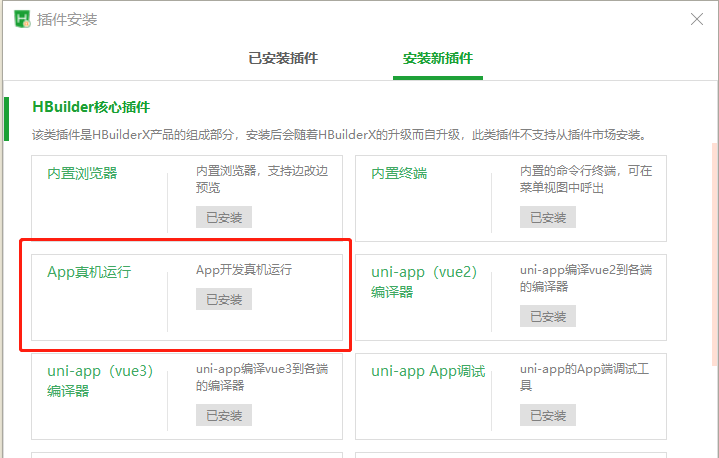
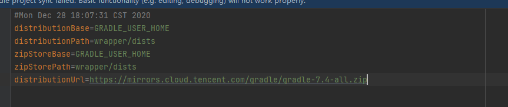
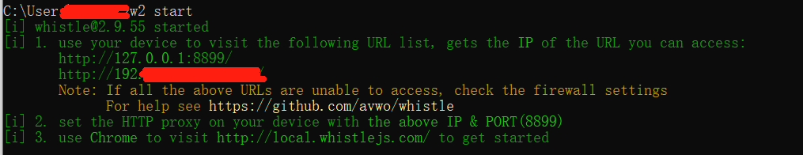
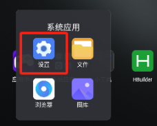
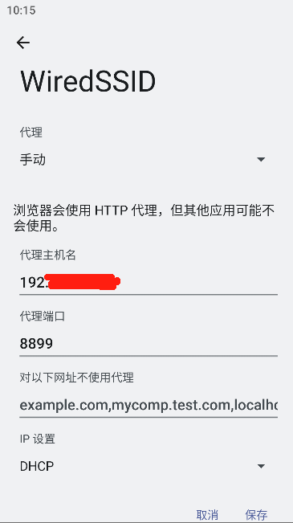
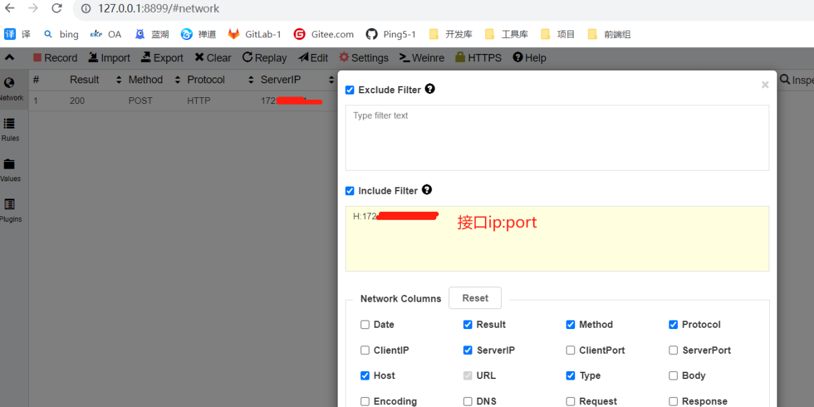
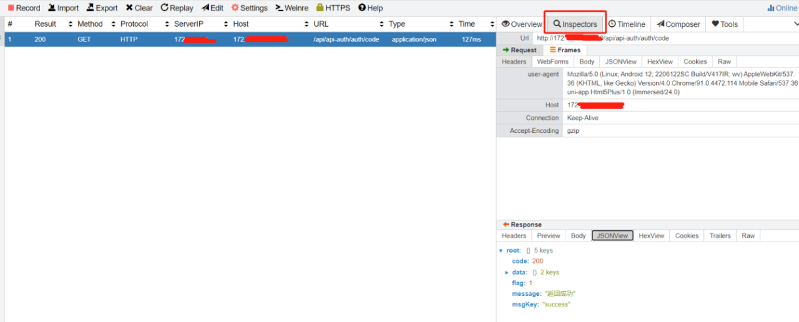
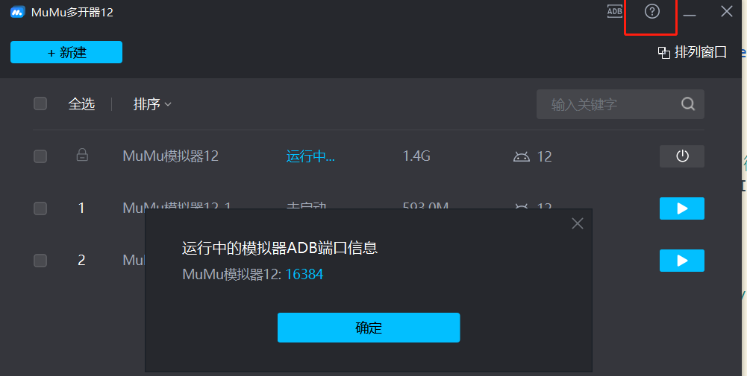
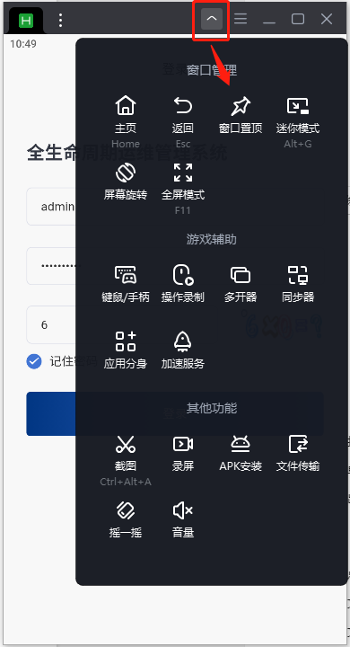

# 相关软件
1. HBuilderX  编码，版本目前我用的是3.8.11.20230719-alpha
2. whistle 网络请求抓包，官网http://wproxy.org/whistle/install.html
3. Mumu 模拟器12，下载官网https://mumu.163.com/

# HBuilderX
## 安装真机运行插件


## 设置运行环境
HBuilderX安装地址\plugins\launcher\tools\adbs


## 配置环境变量：PATH补充adb
HBuilderX安装地址\plugins\launcher\tools\adbs


## 运行
运行->运行到手机或模拟器->运行到Android App基座


## 打包——云打包
打包之后HBuilder终端会给一个链接，点击下载

## 本地打包：
相关应用：Android Studio
需要是当前应用的所有者才能获取设置appkey，证书等。

相关操作参考：
https://www.kdocs.cn/l/ce5gRo7gouKw（sy提供）
https://blog.csdn.net/qq_40230735/article/details/123346723（本地打包过程较完整）

android相关版本参考：
jdk17、gradle：7.4、gradle-plugin:7.4.2

gradle镜像地址：

# whistle
安装：win+R打开终端，npm install -g whistle
运行：win+R打开终端，w2 start

访问：浏览器访问127.0.0.1:8899 

指定端口：w2 start -p XXXX，默认端口为8899，若特别指定端口，app网络代理的端口号需要同步

模拟器网络代理：（抓模拟器包的时候，需要处理模拟器wifi代理

打开设置->网络->代理改为手动。主机名为本地ip，代理端口为whistle 的端口，默认是8899。设置代理后，Hbuilder运行app前必须保证whistle 在运行，不然会连不上



系统应用-设置-网络和互联网-互联网-WiredSSID



抓包过滤：network->setting


查看请求：network->inspectors


# mumu模拟器
设备：默认是平板，设置中心可以设置显示和分辨率

查看mumu模拟器端口：
mumu模拟器安装后自带一个多开器，点击帮助可查看现有端口


多开(同时运行多个模拟器，eg，多个不同权限账号同步操作，测试数据流向)：

通过多开器启动多个模拟器, adb connect连接对应端口（查看模拟器各端口看上一点），如：
```shell
adb connect 127.0.0.1:16384
adb connect 127.0.0.1:16416
```
3、HBuilderX处，运行到手机模拟器
窗口置顶
