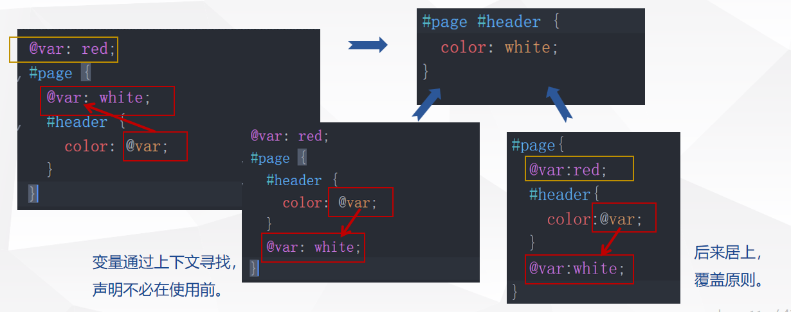
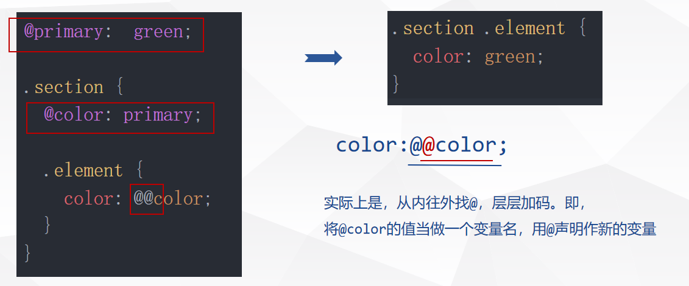

# 简单介绍与安装引入
> Less是什么？

CSS 预处理语言，扩展 CSS 语言，增加了变量、Mixin、函数等特
性，使 CSS 更易维护和扩展。
> 相关链接

- [Less官方文档](https://lesscss.org)
- [Less中文网](http://lesscss.cn)
- [Less转css在线预览](http://lesscss.org/less-preview)
- [Github地址](https://github.com/less/less.js)
- [W3Cschool](https://www.w3cschool.cn/less)


## Less安装及三种使用方式

### Node.js安装
    - 全局安装：`npm install -g less`
    - 指定版本：`npm install less@2.7.1 -g`
    - 仅项目中安装：`npm i less --save-dev`
### 用法
1. 网页用法：文件引入
    ```html
    <link rel="stylesheet/less" type="text/css" href="styles.less" />
    <script src="https://cdn.jsdelivr.net/npm/less"></script>
    ```

2. 命令行用法：编译成目标文件
    - 将less文件A，编译成css文件b：`lessc  A.less  b.css`
    - 将less文件A，编译成css压缩文件b(需要安装clean-css插件)：`lessc --clean-css  A.less  b.min.css`

    [clean-css插件地址](https://github.com/less/less-plugin-clean-css)

3. js代码用法：直接计算样式
   ```js
   const less = require('less');
   less.render(
      '.class { width: (1 + 1) }',// less语句
      {
        paths: ['.', './lib'],  // 指定@import指令的搜索路径
        filename: 'style.less', // 指定文件名，以便定位错误信息
        compress: true          // 压缩css输出文件
      },
      function (e, output) { //相关操作
        console.log(output.css);
      }
   );
   ```

# Features语言特性
## 概览
- 变量(Variables)：插值、作用域、动态变量、属性变量
- 嵌套(Nesting)：嵌套、引用父选择器 &、规则嵌套与冒泡
- 运算(Operations)：`+`、`-`、`*`、`/`  
    注：运算符两侧要留空格
- 混合(Mixins)：namespace命名空间、`@arguments`变量、`...`、`@rest`变量、模式匹配、作为函数使用、递归与循环、守卫
- 合并(Merge)：`+` Comma(用逗号连接)合并，`+_` Space(用空格连接)合并
- 转义(Escape)：`~`"xxx" 或 `~`’xxx’
- 函数(Functions)：见第三部分
- 扩展(Extend)
- 分离规则集(Detached Rulesets)
- 集合(Maps)
- 注释(Comments):多行注释-编译结果保留注释，单行注释-编译结果不保留注释
- 导入(Importing)：`@import "xxx.less"`; 或 `@import "xxx"`;

## Variables(变量)
### 声明及使用
- 变量: `@var:’xxx’`;
    
    eg, `@primary:#333`;
    
    使用: `.btn{color:@primary;}`

- 插值:将变量的值插入到引用的地方 `@{var}`，可用于: 选择器名，属性名，url，@import。eg:

  less：
  ```css
  @imagesUrl:"https://xx";
  .my-image{
    background:url("@{imagesUrl}/cat.jpg")
  }
  ```
  css：
  ```css
  .my-image{
    background:url("https://xx/cat.jpg")
  }
  ```
  
- 默认变量
- 延迟加载

### 作用域(Scope)

- 由内而外找，本级找不到从父级作用域找变量/混合，一层层往上，找到即止。
```css
@var: red;
#page {
  @var: white;
  #header {
     color: @var;
  }
}
```
- 变量通过上下文寻找，声明不必在使用前。
```
@var: red;
#page {
  #header {
     color: @var;
  }
  @var: white;
}
```
- 后来居上，覆盖原则。
```css
#page {
  @var: red;
  #header {
     color: @var;
  }
  @var: white;
}
```
以上均得到结果：
```css
#page #header{
  color: white;
}
```


>[!TIP]个人建议
最好还是统一写在头部

### 动态变量(Variable Variables)
声明时用@，使用时用多个@

Less
```css
@primary: green;
.section{
  @color: primary;
  .element{
    color: @@color;
  }
}
```
css
```css
.section .element{
  color:green;
}
```


### 属性变量
将样式中的属性当做变量，用法:`$prop`

Less
```css
.my-class {
  color: #efefef;
  background-color: darken($color,30%);
}
```
css
```css
.my-class {
  color: #efefef;
  background-color: #a3a3a3;
}
```

## Nesting(嵌套)
### 嵌套：`{}`内层的选择器为{}外层的选择器的后代
```css
.parent  {
  .children{
    ...
  }
}
```
### 引用父选择器
`&`引用后直接加内容，编译结果紧密连接
Less
```css
.parent {
  .children {
    color: blue;
    &:hover {
      color: darkblue;
    }
    &-warn{
      color:red;
    }
  }
}
```
css
```css
.parent .children {
  color: blue;
}
.parent .children:hover {
  color: darkblue;
}
.parent .children-warn {
  color: red;
}
```
#### 多&使用

Less
```css
.btn {
  font-size:16px;
  & & {
    color:red;
  }
  && {
    color:blue;
  }
  & + & {
    margin-left:10px;
  }
  & + &-warn{
    margin-left:10px;
  }
}
```
css
```css
.btn {
  font-size:16px;
}
.btn .btn {
  color:red;
}
.btn.btn {
  color:blue;
}
.btn + .btn {
  margin-left:10px;
}
.btn + .btn-warn{
  margin-left:10px;
}
```
#### 冒泡
当`&`被用在后方，为了匹配.class &，会将.class选择器外提，即冒泡
Less
```css
.btn {
  .card & {
    color: red;
    .footer & {
      background: white;
    }
  }
}
```
css
```css
.card .btn {
  color: red;
}
.footer .card .btn {
  background: white;
}
```
#### 全排列
集合选择器与&结合，实现全排列组合扩展(Combinatorial Explosion)
Less
```css
.input, .select, .picker{
  & + & {
    margin-left:10px;
  }
}
```
css
```css
.input + .input,
.input + .select,
.input + .picker,
.select + .input,
.select + .select,
.select + .picker,
.picker + .input,
.picker + .select,
.picker + .picker {
  margin-left:10px;
}
```

:::warning[注意]
`&`表示的是规则内的**所有**父选择器
:::


## Merge(合并)
`+`：逗号合并，`+_`：空格合并，在属性末尾补充

Less
```css
.myfun1(){
  box-shadow+:5px 5px 5px grey;
}
.class1{
  .myfun1();
  box-shadow+:0 0 5px black;
}
```
css
```css
.class1 {
  box-shadow: 5px 5px 5px grey, 0 0 5px black;
}
```
Less
```css
.myfun2(){
  transform+_:scale(1);
}
.class2{
  .myfun2();
   transform+_:rotate(2deg);
}
```
css
```css
.class2 {
  transform: scale(1) rotate(2deg);
}
```
## Escape(转义)
`~"xxx"` 或 `~’xxx’`。
转义：引号内的内容原封不动的放进去，试了一下，不支持多层嵌套转义
Less
```css
@color-danger:red;
.color{
  color:~"@{color-danger}";
}
```
css
```css
.color {
  color: red;
}
```
## Extends(扩展)
类似伪类，继承，`.A:extend(.B)`
A类继承B类的所有属性，编译结果为分组选择器，能避免输出重复语句，减少css文件大小。

Less
```css
.a{
  color:red;
}
.a:hover{
  background:blue;
}
.a-p .a{
  border-color:blue;
}
.b:extend(.a){
  border:1px solid red;
}
```
css
```css
.a,
.b {
  color: red;
}
.a:hover {
  background: blue;
}
.a-p .a {
  border-color: blue;
}
.b {
  border: 1px solid red;
}
```
.A:extend(.B all)加上`all`关键字，A类继承所有 含有.B的选择器的所有属性。

Less
```css
.a{
  color:red;
}
.a:hover{
  background:blue;
}
.a-p .a{
  border-color:blue;
}
.b:extend(.a all){
  border:1px solid red;
}
```
css
```css
.a,
.b {
  color: red;
}
.a:hover,
.b:hover {
  background: blue;
}
.a-p .a,
.a-p .b {
  border-color: blue;
}
.b {
  border: 1px solid red;
}
```
# Mixin与Map
## Mixin(混合)
### 基础使用
- 声明：不带括号的编译会输出，带括号的编译不会输出
- 调用：带括号或不带括号都可以
- 不带括号 `[#|.]mixinName{}`     eg, #mixin1{}, .mixin2{}
- 带括号   `[#|.]mixinName(){}`   eg, .mixin3(){}, .mixin4(){}

Less
```css
.mix-1{
  color:red;
}
.mix-2(){
  background:white;
}
.class-1{
  .mix-1;
  .mix-2;
}
.class-2{
  .mix-1();
  .mix-2();
}
```
css
```css
.mix-1 {
  color: red;
}
.class-1 {
  color: red;
  background: white;
}
.class-2 {
  color: red;
  background: white;
}
```
### 命名空间
使用变量/混合时，用`>`，空格连接，或直接连接均可。但前两项在官方文档中显示可能会废除，建议直接连着写。

Less
```css
#outer(){
  .inner{
    color:red;
 }
}

.class-1{
  #outer>.inner();
}
.class-2{
  #outer .inner();
}
.class-3{
  #outer.inner();
}
```
css
```css
.class-1 {
  color: red;
}
.class-2 {
  color: red;
}
.class-3 {
  color: red;
}
```
### 参数变量
- @argument: @arguments包含了所有传递进来的参数。
- ...: 变量名后添加 ...，表示这里可以使用 N 个参数。
- @rest: 表示 @a 之后的参数
```
.mixin (...) {}        // 接受 0-N 个参数
.mixin () {}           // 不接受任何参数
.mixin (@a: 1) {}      // 接受 0-1 个参数
.mixin (@a: 1, ...) {} // 接受 0-N 个参数
.mixin (@a, ...) {}    // 接受 1-N 个参数
.mixin (@a, @rest...) {}
```

Less
```css
.box-shadow(@x:0,@y:0,@blur:1px,@color:red){
  box-shadow:@arguments;
}
.block-1{
  .box-shadow();
}
.block-2{
  .box-shadow(2px,5px);
}
```
css
```css
.block-1 {
  box-shadow: 0 0 1px red;
}
.block-2 {
  box-shadow: 2px 5px 1px red;
}
```
### 模式匹配
通过值和入参数量进行匹配。
>[!TIP]
`@_` 匹配所有值
Less
```css
.mixin(dark,@color){
  background:darken(@color,10%);
}
.mixin(light,@color){
  background:lighten(@color,10%);
}
.mixin(@_,@color){
  color:@color;
}
.class-1{
  .mixin(dark,red);
}
.class-2{
  .mixin(light,red);
}
```
css
```css
.class-1 {
  background: #cc0000;
  color: red;
}
.class-2 {
  background: #ff3333;
  color: red;
}
```
Less
```css
.mixin(@a){
  color:@a;
}
.mixin(@a,@b){
  border:1px solid @a;
  background:@b;
}

.class-1{
  .mixin(red);
}
.class-2{
  .mixin(red,blue);
}
```
css
```css
.class-1 {
  color: red;
}
.class-2 {
  border: 1px solid red;
  background: blue;
}
```
### 作为函数使用
- 声明：mixin()，在里头声明一个变量。
- 使用：引用mixin,用`[@varName]`调取对应的返回值，
	  若[]内没有写明变量名则返回最后一个变量的值。
Less
```css
.mixin(@x,@y){
  @result:((@x + @y)/2);
  @result2:((@x + @y)/2 + 10);
}
.class-1{
  padding:.mixin(10px,20px)[@result];
  margin:.mixin(10px,20px)[];
}
```
css
```css
.class-1 {
  padding: 15px;
  margin: 25px;
}
```
### Guard守卫when ()
- 用于匹配表达式上的简单值或参数个数，匹配内容必须在括号中。
- 与mixin声明相关联，并包括附加到mixin的条件。 
- 每个mixin可以有多个when语句。 
- LESS使用Guards的mixins而不是if / else语句，并执行计算以指定匹配的mixin。

Less
```css
@media: mobile;
.mixin(@a) when (@media = mobile){
  font-size:@a - 2;
}
.mixin(@a) when (@media = desktop){
  font-size:@a + 2;
}
.btn{
  .mixin(14px);
}
```
css
```css
.btn {
  font-size: 12px;
}
```
### 递归
循环：利用递归及when实现
>[!TIP]
此处when在逻辑上和while很像，只有condition为真时才会执行{}内的语句，但实际上，如果condition为false,.A不会被编译出来`.A when( condition ){}`

Less
```css
.positon-absolute(@n,@i:1) when(@i <@n){
  &:nth-child(@{i}){
    top: 40px*(@i - 1);
  }
  .positon-absolute(@n,(@i+1));
}
.card{
  position:absolute;
  .positon-absolute(6);
}
```
```css
.card {
  position: absolute;
}
.card:nth-child(1) {
  top: 0px;
}
.card:nth-child(2) {
  top: 40px;
}
.card:nth-child(3) {
  top: 80px;
}
.card:nth-child(4) {
  top: 120px;
}
.card:nth-child(5) {
  top: 160px;
}
```

## Maps(集合)
### 基础使用
- 定义：@集合名:{变量名:变量值}
- 使用：@集合名[变量名]

Less
```css
@sizes:{
  mobile:720px;
  tablet:1200px;
  desktop:1560px;
}
.navbar{
  display:block;
  @media(min-width:@sizes[tablet]){
    display:inline-block;
  }
}
```
css
```css
.navbar {
  display: block;
}
@media (min-width: 1200px) {
  .navbar {
    display: inline-block;
  }
}
```
## Mixinin函数与Maps(集合)的区别
|      | Mixinin函数    | Maps(集合) |
|------|----------------|------------|
|声明|`.mixin(){}`|`@map:{}`|
|参数|可带参|不带参|
|内部变量声明|`@varName:value;`|`varName:value;`|
|取值|`.mixin()[@varName]`|`@map[varName]`|

Less
```css
@size-map:{
  mobile:720px;
  tablet:1200px;
  desktop:1560px;
}

.size-mixin{
  @mobile:720px;
  @tablet:1200px;
  @desktop:1560px;
}

.navbar{
  display:block;
  @media(min-width:@size-map[tablet]){
    display:inline-block;
  }
  @media(min-width:.size-mixin[@desktop]){
    color:red;
  }
}
```
css
```css
.navbar {
  display: block;
}
@media (min-width: 1200px) {
  .navbar {
    display: inline-block;
  }
}
@media (min-width: 1560px) {
  .navbar {
    color: red;
  }
}
```
## Detached Rulesets(分离规则集)
- 分离的规则集：包含一个普通的规则集，如属性，嵌套规则集，变量声明，mixins等。
- 当它被别的结构引用时，其中的所有属性都将被复制到该结构。
- mixin在引用规则集后，能直接调用。
- 规则集内，变量的有效范围仅在规则集中，并不会暴露到外头。
Less
```css
@ruleset:{
  color:red;
  @color2:blue;
  .mixin(){
    border:1px solid @color2;
  }
  @map:{
    background:white;
  }
}

.cont{
  @ruleset();
  .mixin;
  // background:@color2; //variable @color2 is undefined
}
```
css
```css
.cont {
  color: red;
  border: 1px solid blue;
}
```
# Functions内置函数
## 概览
- 逻辑：`if`，`boolean`
- 字符串：`escape`, `e`, `%` `format`, `replace`(可用正则)
- 列表：`length`, `extract`(下标取值), `range`(生成一定线形步幅列表), each(遍历)
- 数学：`ceil`, `floor`, `percentage`, `round`, `sqrt`, `abs`, `sin`, `asin`, `cos`, `acos`, `atan`, `pi`, `pow`, `mod`, `min`, `max`
- 类型：`isnumber`, `isstring`, `iscolor`, `iskeyword`, `isurl`, `ispixel`, `isem`, `ispercentage`, `isunit`, `isruleset`, `isdefined`
- 其他：`color`, `image-size`, `image-width`, `image-height`, `convert`(修改量级), `data-uri`, `default`, 
          `unit`(去单位/修改单位), `get-unit`(获取单位), `svg-gradient`
- 颜色：Definition定义, Channel通道, Operation操作, Blending混合
### 逻辑运算
#### if
`if((condition), value1, value2)`
- 三元运算：condition为真返回value1,否则返回value2
eg. `margin: if((2 > 1), 0, 3px)`;
- 相关逻辑符号： `not` 表示非，`and` 表示与，`or` 表示或

eg.
```css
if(not (true), foo, bar);
if((true) and (2 > 1), foo, bar);
if((false) or (isstring("boo!")), foo, bar);
```

#### boolean
`boolean(condition)`

Less
```css
@dark:darkblue;
@light:blue;
@bg:black;
@is-light:boolean(luma(@bg)>50%);
.color{
  color:if(@is-light,@light,@dark);
}
```
css
```css
.color {
  color: darkblue;
}
```

### 列表
#### 遍历
语法：`each(list,.(@value,@key,@index),rules)` 
>[!TIP] 备注
  @index下标从1开始

Less
```css
@font-primary:blue;
@font-danger:red;
@font-success:green;
@font-arr: primary,danger,success;
each(@font-arr,{
  .color-@{value}{
    color:~'@{font-@{value}}';
  }
})
```
css
```css
.color-primary {
  color: blue;
}
.color-danger {
  color: red;
}
.color-success {
  color: green;
}
```
Less
```css
@space-map:{
  p:padding;
  pt:padding-top;
  pb:padding-bottom;
  pl:padding-left;
  pr:padding-right;
}
@space-range:2,8,12;
each(@space-range,.(@value,@key,@index){
  each(@space-map,.(@v,@k,@i){
    .@{k}@{value}{
       @{v}:(@value)+0px;
    }
  })
})
```
css
```css
.p2 {
  padding: 2px;
}
.pt2 {
  padding-top: 2px;
}
.pb2 {
  padding-bottom: 2px;
}
.pl2 {
  padding-left: 2px;
}
.pr2 {
  padding-right: 2px;
}
.p8 {
  padding: 8px;
}
.pt8 {
  padding-top: 8px;
}
.pb8 {
  padding-bottom: 8px;
}
.pl8 {
  padding-left: 8px;
}
.pr8 {
  padding-right: 8px;
}
.p12 {
  padding: 12px;
}
.pt12 {
  padding-top: 12px;
}
.pb12 {
  padding-bottom: 12px;
}
.pl12 {
  padding-left: 12px;
}
.pr12 {
  padding-right: 12px;
}
```

#### 数组定义
语法：`range(start,end,step) `。
>[!TIP] 备注
  若只写一个参数，则表示为：从1开始，到该参数止，步幅为1
Less
```css
each(range(3),{
  .grid-col-@{value}{
    grid-template-columns:repeat(@value,1fr);
  }
})
```
css
```css
.grid-col-1 {
  grid-template-columns: repeat(1, 1fr);
}
.grid-col-2 {
  grid-template-columns: repeat(2, 1fr);
}
.grid-col-3 {
  grid-template-columns: repeat(3, 1fr);
}
```
#### 列表取值
语法：`extract(list,index)`
Less
```css
.tag-plain{
  border:1px solid red;
  color: red;
}
.tag{
  .tag-plain();
   background: lighten(extract($border,3),0.1);
}
```
css
```css
.tag-plain {
  border: 1px solid red;
  color: red;
}
.tag {
  border: 1px solid red;
  color: red;
  background: #ff0101;
}
```
### 部分函数注意事项
### isnumber
判true的情况有：
1. 纯数字, eg. 10
2. 百分比, eg. 10%
3. 数字带单位, eg. 10px, 10vw, 10rem
### isstring
- 仅用“”引起来的内容为true
eg, isstring(blue)将返回false

### image-size
- 作用：获取图片的大小，返回值单位为px
- 使用：image-size("file.png")
- 有关图片的内置函数，均只能处理本地静态图片

### 颜色
1. Definition颜色定义：`rgb`, `rgba`, `hsl`, `hsla`, `hsv`, `hsva`
2. Channel颜色通道：`hue`, `saturation`, `lightness`, `hsvhue`, `red`, `green`, `blue`, `alpha`, `luma`, `luminace`
3. Operation颜色操作运算：`saturate`, `desaturate`, `lighten`,  `darken`, `fadein`, `fadeout`, `fade`, `spin`, `mix`, `tint`, `shade`, `greyscale`, `contrast`
4. Blending颜色混合：`multiply`, `screen`, `overlay`, `softlight`, `hardlight`, `difference`, `exclusion`, `average`, `negation`


