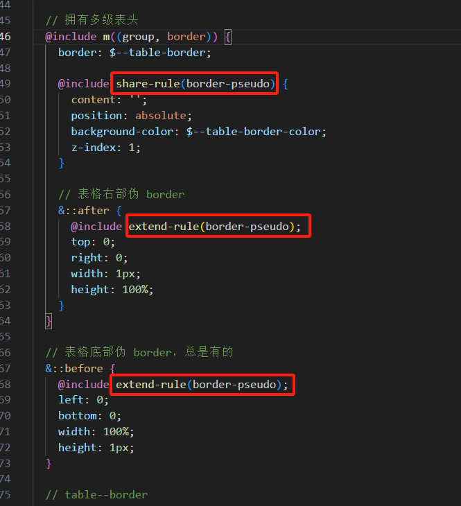

> 相关链接
- [scss官网](https://sass-lang.com/documentation)
- [scss函数](https://zhuanlan.zhihu.com/p/436923569)
- [在线scss转css](https://www.sassmeister.com)
- [在线css转scss](https://www.sass.hk/css2sass)

# Scss
## 一、有别于Less的独有写法
### 1. 属性嵌套(有相同的属性前缀)
```css
.box {
  font: {
    size: 12px;
    weight: bold;
  }  
}
```
编译结果
```css
.box {
  font-size: 12px;
  font-weight: bold;
}
```
### 2. 占位符%
用占位符声明的代码，如果不被@extend调用就不会被编译。
```css
%mt5 {
   margin-top: 5px;
}
.btn {
  color:red;
}
```
编译结果：%占位符声明的代码没有被编译产生css代码
```css
.btn {
  color:red;
}
```
使用@extend调用，通过@extend调用的占位符，编译出来的代码会将相同的代码合并在一起，代码更简洁。
```css
%mt5 {
margin-top: 5px;
}
%pt5{
padding-top: 5px;
}
.btn {
@extend %mt5;//使用@extend调用占位符代码
@extend %pt5;
}
.block {
@extend %mt5;
span {
@extend %pt5;
}
}
```
编译结果
```css
.btn, .block {
margin-top: 5px;
}
.btn, .block span {
padding-top: 5px;
}
```
### 3. !global变量提升
```css
#menu {
  $width: 5rem !global;
  width: $width;
}

#sidebar {
  width: $width;
}
```
编译结果
```css
#menu {
  width: 5rem;
}

#sidebar {
  width: 5rem;
}
```
### 4. 嵌套的@import
```css
.demo {
  color: red;
}
#app {
  @import "demo"; // 在文件app.scss中引入demo.scss
}
```
编译结果
```css
#app .demo {
  color: red;
}
```
### 5. 颜色运算（这个less也有）
```css
p {
color: #010203 + #040506;
}
```
计算公式为 01 + 04 = 05、02 + 05 = 07 和 03 + 06 = 09， 并且被合成为：
```css
p {
color: #050709;
}
```
数字和颜色一起运算：
```css
p {
color: #010203 * 2;
}
```
计算公式为 01 2 = 02、02 2 = 04 和 03 * 2 = 06， 并且被合成为：
```css
p {
color: #020406;
}
```
### 6. 字符拼接
有引号的字符串和没有引号的字符串相加
以最左侧的为准：第一个有引号则最后结果有引号，第一个没有引号则最后结果没有引号
```css
p:before {
content: "Foo " + Bar;
font-family: sans- + "serif";
}
```
编译结果
```css
p:before {
content: "Foo Bar";
font-family: sans-serif; 
}
```

## 二、内置函数
[对应官网目录](https://sass-lang.com/documentation/modules/)
1. color: adjust-color、adjust-hue、opacity、rgba、rgb、rgba、lighten、darken、saturate、desaturate、grayscale、complement...
2. string: unquote、quote、str-length、str-insert、to-upper-case、to-lower-case、to-lower-case....
3. list: length、nth、append、join、zip……
4. map: map-get、map-merge、map-remove、map-keys、map-values……
5. number: percentage、ceil、floor、min、max……
6. selector: selector-nest、selector-append、selector-replace、selector-unify……
7. simple: unit、unitless、abs、round、random、if、feature-exists……

# Scss在element-ui中的应用
## 一、mixins文件
### 1. 文件目录
`/theme-chalk/src/mixins`
### 2. /config.scss
分别定义了BEM的：
①命名空间（前缀）
②元素分隔符（元素之前）
③修饰分隔符（修饰符之前）
④Boolean状态标识前缀

```css
$namespace: 'el';
$element-separator: '__';
$modifier-separator: '--';
$state-prefix: 'is-';
```
以便得到形如：前缀-块__元素--修饰 的结构：
```css
.el-table--medium
.el-table__body
.el-table__header
```
### 3. /mixins.scss
1.	res	循环断点，方法内部含有媒体查询，实际应用于生成el-col-xx，优化代码避免重复生成用的
2.	scroll-bar	滚动条样式
3.	placeholder	标识placeholder这个input内置元素
4.	b	BEM之B, 生成class类名：给块元素添加前缀
5.	e	BEM之E, 生成class类名：给元素添加前缀
6.	m	BEM之M, 生成class类名：处理修饰，（如颜色、尺寸、方圆、水平垂直、前后缀等等）
7.	configurable-m	源码中似乎没有调用，看代码像是处理标记类的样式
8.	spec-selector	源码中似乎没有调用，看代码像是meb的进化版
9.	meb	源码中似乎没有调用，看代码像是生成BEM命名用的
10.	when	生成有状态的class类名：与前面config定义的$state-prefix结合使用，补充状态前缀 如when(fixed)生成的类名是is-fixed
11.	extend-rule	继承share-rule中的样式规则
12.	share-rule	类似于vue中的bus，定义公共样式规则，给extend-rule用
13.	pseudo	生成class类名：伪类选择器
附：share-rule和extend-rule的实际使用场景

### 4. /funtion.scss
#### 选择器名转为字符串
```css
@function selectorToString($selector) {
  $selector: inspect($selector);
  $selector: str-slice($selector, 2, -2);
  @return $selector;
}
```
#### 是否有修饰字段
```css
@function containsModifier($selector) {
  $selector: selectorToString($selector);
  @if str-index($selector, $modifier-separator) {
    @return true;
  } @else {
    @return false;
  }
}
```
#### 是否有Boolean状态标识
```css
@function containWhenFlag($selector) {
  $selector: selectorToString($selector);
  @if str-index($selector, '.' + $state-prefix) {
    @return true
  } @else {
    @return false
  }
}
```
#### 是否包含伪类选择器
```css
@function containPseudoClass($selector) {
  $selector: selectorToString($selector);
  @if str-index($selector, ':') {
    @return true
  } @else {
    @return false
  }
}
```

```css
@function hitAllSpecialNestRule($selector) {
  @return containsModifier($selector) or containWhenFlag($selector) or containPseudoClass($selector);
}
```

### 5. /utils.scss
1.	utils-user-select	鼠标选中状态混合
2.	utils-clearfix	清除浮动方法
3.	utils-vertical-center	垂直居中方法
4.	utils-ellipsis	一行超出省略方法
### 6. /_button.scss
按钮样式补充：plain、variant、size

## 二、各组件样式中mixins的应用
使用格式
```css
@include b(button){
  @include when(plain){
    ...
  }
  @include m(primary){
    ...
  }
}
```
生成
```css
.el-button.is-palin{...}
.el-button--primary{...}
```
## 三、色彩
### 色彩变量文件路径
`/theme-chalk/src/common/var.scss`

### 色彩规则
- element-ui的可替换颜色统一放在一个文件中，内部含有引用和混合
- 以`primary`、`success`、`warning`、`danger`、`info`及`white`、`balck`为主进行混合
- `$--color-primary`有与白色混合1-9个度
- 其他颜色则更具体，light是80%，lighter是90%
`$--color-[success|warning|danger|info]-light:
mix($--color-white, $--color-[success|warning|danger|info], 80%)`


