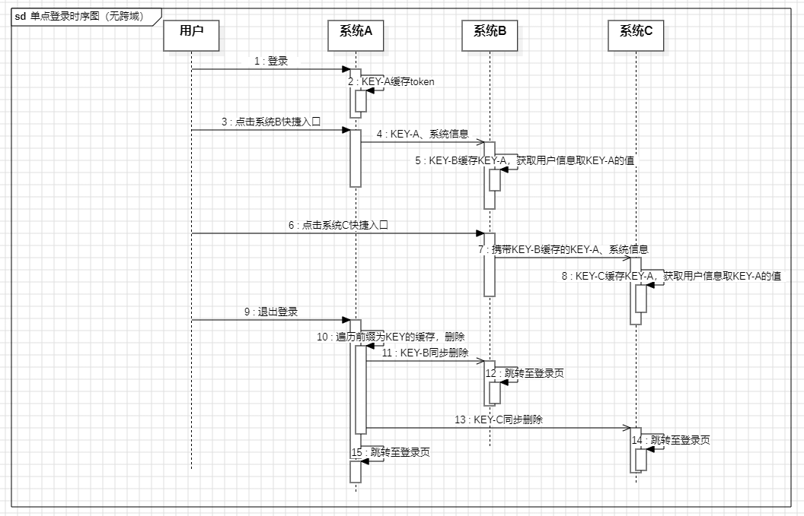

## 背景
1. 现有系统A、系统B、系统C，其中A为主系统，A可以快捷访问B、C，B可以快捷访问C
2. 系统ABC在同一域名下，即可以访问同一个localStorage/cookie
3. 要求：①A快捷访问BC、B快捷访问C时，无痕登录；②一处系统退出，所有系统均退出

## 时序图



## 实现
### 0. 约定
所有系统与登录信息相关的缓存key均以`KEY-Token`为前缀，除主系统登录token缓存key为`KEY-Token`，其余缓存key形如`KEY-Token-XX`。约定值可改，需各系统保持一致，在退出登录时才能完全清除登录缓存信息

### 1. 主系统A登录缓存信息
local.js：缓存用户信息，登录时调用setLoginData
```js
export const TokenKey = 'KEY-Token';
export function setLoginData(data) {
  localStorage.setItem(TokenKey, data.token);
  // ...设置其他缓存，缓存以TokenKey为前缀
}

/* 退出删除Token */
export function removeToken() {
  // ... 删除其他缓存
  // 删除所有系统的Token及相关内容
  for (let i=0; i<localStorage.length; i++) {
    localStorage.key(i) !== TokenKey && localStorage.key(i)?.startsWith(TokenKey) && localStorage.removeItem(key);
  // 最后删除本系统key
  localStorage.removeItem(TokenKey);
  }
}
```
### 2. 主系统A访问子系统
```html
<el-link :href="sysUrl_B"  target="_blank">系统B</el-link>
<el-link :href="sysUrl_C"  target="_blank">系统C</el-link>

const sysUrl_B =
    import.meta.env.VITE_HOME_URL + `/b/#/login-cas?key=${TokenKey}&title=${title}`;
const sysUrl_C =
    import.meta.env.VITE_HOME_URL + `/c/#/login-cas?key=${TokenKey}&title=${title}`;

```
### 3.子系统B处理登录
router.js：拦截入参
```js
router.beforeEach(async (to, from, next) => {
  setKeyConfig(to.query);
  // ... 
})
```
local.js：处理入参
```js
const TokenKey = 'KEY-Token-B'; // 缓存键-系统B非单点登录下缓存token
const systemTokenKey = 'KEY-Token-B-S'; // 缓存键-系统B单点登录缓存源Token对应的Key

/* 设置单点登录配置 */
export function setKeyConfig(data) {
  const { key } = data;
  if (!key) {
    return;
  }

  localStorage.setItem(systemTokenKey, key);
  // ...设置其他缓存，缓存以key为前缀
}

/* 获取本系统Token对应的Key */
export function getSystemKey() {
  return localStorage.getItem(systemTokenKey) || TokenKey;
}

/* 获取本系统Token */
export function getToken() {
  let key = getSystemKey();
  let keyValue = localStorage.getItem(key) || Cookies.get(key);
  return keyValue;
}

/* 本系统手动登录时缓存Token */
export function setToken(data) {
  let key = getSystemKey();
  localStorage.setItem(key, data.token);
  // ...设置其他缓存，缓存以key为前缀
}

/* 退出删除Token */
export function removeToken() {
  // ... 删除其他缓存
  let key = getSystemKey();
  // 删除所有系统的Token及相关内容
  for (let i=0; i<localStorage.length; i++) {
    localStorage.key(i)!== key && localStorage.key(i)?.startsWith('KEY-Token') && localStorage.removeItem(key);
  }
  // 最后再删除sysKey
  localStorage.removeItem(key);
}
```
### 4.子系统B访问子系统C
```html
<el-link :href="sysUrl_C"  target="_blank">系统C</el-link>

const TokenKey = getSystemKey();
const sysUrl_C =
    import.meta.env.VITE_HOME_URL + `/c/#/login-cas?key=${TokenKey}&title=${title}`;

```
### 5.单系统退出，所有系统同步退出
App.vue 监听token主键的变化，以便实时跳转到登录页
```
mounted() {
  this.systemKey = getSystemKey();
  this.loginAddress = window.location.origin; // 如有重定向需要，此处取对应缓存值
  window.addEventListener('storage', this.updateStorage);
},
beforeDestroy() {
  window.removeEventListener('storage', this.updateStorage);
},
methods: {
  updateStorage() {
    // 系统主键Key被删除，重定向
    if(e.key !== this.systemKey || e.newValue) return;

     window.location.href = loginAddress; 
  }
}
```
